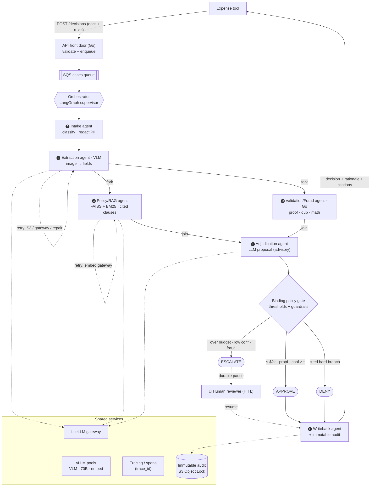

# agent_request_approval

Multi-agent reimbursement-approval platform. A `POST /decisions`-style pipeline
analyzes receipt documents and returns an auditable **APPROVE / DENY / ESCALATE**
decision with confidence, rationale, and cited policy clauses.

- **Design spec:** `docs/superpowers/specs/2026-06-28-reimbursement-multiagent-design.md`
- **Phased plans:** `docs/superpowers/plans/`

## Architecture

A LangGraph supervisor routes six specialized agents; the `extract`, `policy_retrieve`, and
`validate` agents each run a **retry loop** on transient failure, and the binding **policy gate**
(not the LLM) makes the final call.



Text view of the happy path:

```
intake -> extract(VLM) -> { policy_retrieve(RAG) , validate(fraud) } -> adjudicate -> gate -> {APPROVE|DENY|ESCALATE}
```

- **Go** (`services/go`) — API front door, deterministic validation/fraud, expense-tool
  writeback, immutable audit records.
- **Python** (`services/py`) — LangGraph orchestration and the LLM/ML agents (extraction,
  RAG, adjudication), safety guards, eval, tracing.

### Key properties

- **Loops on failure:** S3 retrieval, model-gateway calls, and extraction each retry with
  backoff; an extraction-repair loop re-prompts on invalid/low-confidence output. Exhausted
  loops raise a flag and escalate — never crash, never silently approve.
- **Binding safety gate:** the LLM proposal is advisory; a pure-function policy gate is binding
  (no auto-approve over budget, no ungrounded denial, receipt proof required).
- **Traceable:** every case gets a trace id shared by all spans and the final decision; an
  immutable audit record captures inputs, citations, model versions, and final actor.
- **Security:** input/S3-URI validation, PII redaction before logging, prompt-injection fencing.

## Develop

```bash
# Python
cd services/py && python3.12 -m venv .venv && . .venv/bin/activate
pip install -e . pytest respx ruff
pytest -q

# Go
cd services/go && go test ./...

# Everything (from repo root)
make test
make eval     # runs the decision-quality gate
```
